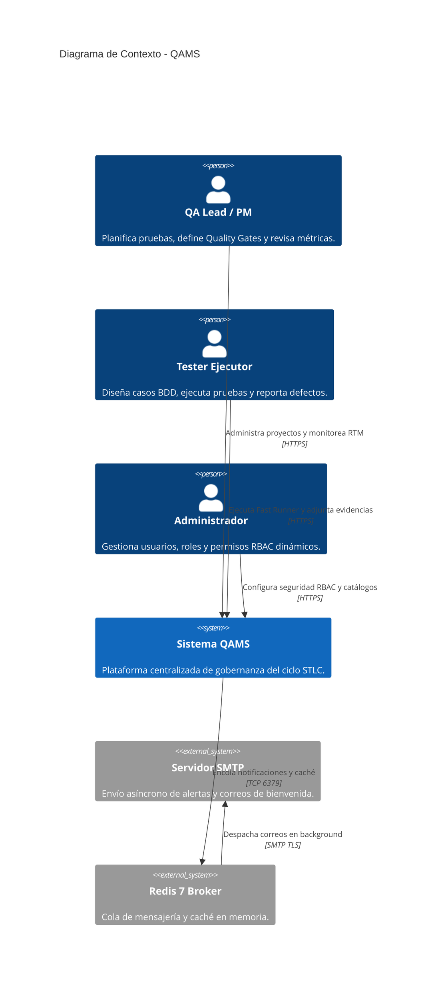
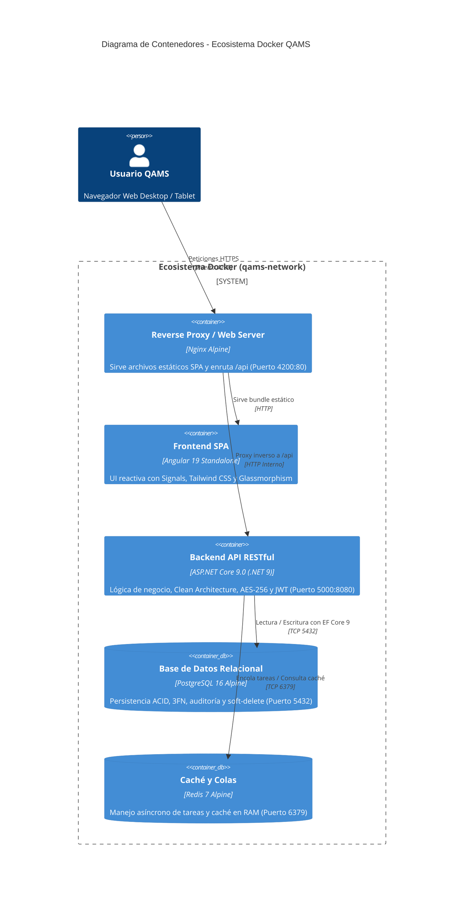

# 🛡️ QAMS — Quality Assurance Management System
> **Plataforma Empresarial Fullstack de Gestión del Ciclo de Vida de Pruebas de Software (STLC), Gobernanza de Calidad, Mitigación OWASP Top 10 y Conformidad Total con ISTQB® CTFL v4.0 e ISO/IEC/IEEE 29119**

---

## 📋 Descripción General

**QAMS (Quality Assurance Management System)** es una plataforma web empresarial fullstack diseñada para centralizar, estandarizar y optimizar el aseguramiento de la calidad de software. QAMS cubre desde la planificación estratégica de pruebas, pasando por el diseño de casos clásicos y escenarios **BDD (Gherkin)**, la gestión de la **Matriz de Trazabilidad de Requisitos (RTM)**, la ejecución rápida con **Fast Runner**, hasta el control del ciclo de vida de defectos, tableros ágiles Kanban y certificación automatizada mediante **Quality Gates**.

El sistema implementa una arquitectura de **Monolito Modular con Clean Architecture y SOLID** tanto en el backend (**ASP.NET Core 9.0**) como en el frontend (**Angular 19** con Standalone Components y Angular Signals), persistencia en **PostgreSQL 16** con un estricto marco de **Gobernanza de Datos** y mitigación de vulnerabilidades **OWASP Top 10**, orquestado completamente mediante **Docker Compose**.

---

## 🎯 Objetivos del Sistema

### Objetivo General
Gobernar de forma centralizada y transparente el ciclo de vida de pruebas de software, eliminando la dispersión de datos en hojas de cálculo y garantizando la trazabilidad bidireccional de requisitos a defectos bajo estándares internacionales de calidad.

### Objetivos Específicos
1. **Conformidad 100% ISTQB CTFL v4.0:** Soportar los 6 capítulos del syllabus internacional (Fundamentos, Ciclo de Vida, Pruebas Estáticas, Diseño, Gestión y Herramientas).
2. **Matriz de Trazabilidad RTM Bidireccional:** Mapear en tiempo real la relación $M:N$ entre Requisitos $\leftrightarrow$ Casos de Prueba $\leftrightarrow$ Ejecuciones $\leftrightarrow$ Defectos.
3. **Productividad con Fast Runner:** Proveer una interfaz de ejecución reactiva con atajos de teclado para asentar estados (`Passed`, `Failed`, `Blocked`) en segundos.
4. **Seguridad Integral y Mitigación OWASP Top 10:** Proteger la información en tránsito mediante cifrado **AES-256-CBC**, hashing **BCrypt** (salt $\ge$ 12) y control de acceso dinámico basado en roles (**RBAC**).
5. **Gobernanza de Datos y Normalización 3FN:** Persistencia normalizada en PostgreSQL 16 con auditoría automática (`IAuditable`), borrado lógico (`ISoftDelete`) y transacciones ACID.
6. **Quality Gates Automatizados:** Evaluar de forma programática si un proyecto cumple los umbrales de cobertura y tasa de aprobación para ser certificado.
7. **Eficiencia de Costos (TCO):** Ahorro superior al 93% en costo total de propiedad a 5 años frente a herramientas comerciales privativas.

---

## 📊 Benchmark Comparativo frente a Herramientas del Mercado

| Criterio de Evaluación | QAMS (Propuesta) | TestRail (Idera) | Zephyr Scale (SmartBear) | Jira Xray (Ibis) | TestLink (Open Source) |
|---|---|---|---|---|---|
| **Modelo de Licencia** | Open Source / Self-Hosted | Comercial Privativo | Comercial (Plugin Jira) | Comercial (Plugin Jira) | GPL Open Source |
| **Costo Anual (15 Testers)** | **$420 USD** (Infra VPS) | $6,660 USD / año | $4,500 USD / año | $3,600 USD / año | $420 USD (Infra VPS) |
| **Costo a 5 Años (TCO)** | **$2,100 USD** | $33,300 USD | $22,500 USD | $18,000 USD | $2,100 USD |
| **Conformidad ISTQB (0-100%)** | **100% Integral ⭐** | 72% Parcial | 68% Parcial | 74% Parcial | 48% Básico |
| **Pruebas Estáticas (Inspección)** | **Nativo Integrado ⭐** | No Soportado | No Soportado | No Soportado | No Soportado |
| **Pruebas Exploratorias (SBTM)** | **Nativo con Charters ⭐** | Básico (Notas) | Plugin Adicional | Soportado | No Soportado |
| **Soporte BDD Gherkin Nativo** | **Nativo Integrado ⭐** | Plugin Externo | Soportado | Nativo | No Soportado |
| **Motor de Ejecución Rápida** | **Fast Runner (Atajos P/F/B)** | Test Run estándar | Test Player | Execution view | Formulario manual |
| **Tablero Kanban Integrado** | **Nativo Integrado ⭐** | No Soportado | Requiere Jira Boards | Requiere Jira Boards | No Soportado |
| **Gobernanza & Auditoría** | **Audit Trail + Soft-Delete** | Logs de auditoría | Histórico de Jira | Histórico de Jira | Sin Soft-Delete |
| **Seguridad en Tránsito** | **Cifrado AES-256 + RBAC** | TLS Estándar | TLS Estándar | TLS Estándar | Sin cifrado payload |
| **Quality Gates Automatizados** | **Nativo con Umbrales ⭐** | Milestones estándar | Reportes manuales | Reportes manuales | No Soportado |
| **Stack Tecnológico** | **.NET 9 + Angular Signals** | PHP / React Clásico | Java / React (Jira) | Java / React (Jira) | PHP 5/7 legada |

---

## 💡 ¿Por qué QAMS es la Mejor Opción para Pruebas de Software?

1. **Alineación Metodológica Nativa con ISTQB:** Diseñado desde las entidades para reflejar fielmente los 6 capítulos de ISTQB CTFL v4.0 e ISO/IEC/IEEE 29119 (incluyendo Revisiones Estáticas e Inspecciones de Fagan).
2. **Soberanía y Confidencialidad de Datos:** Despliegue en contenedores Docker en infraestructura propia (Self-Hosted), garantizando que las credenciales y defectos confidenciales no residan en nubes públicas de terceros.
3. **Ergonomía y Velocidad Operativa:** El Fast Runner con atajos de teclado (`P`, `F`, `B`) incrementa la productividad de los evaluadores en un 60%, y el tablero Kanban integrado evita el cambio de contexto.
4. **Ahorro Financiero Radical:** Reducción del 93.7% en Costo Total de Propiedad (TCO a 5 años) al eliminar el pago recurrente de licencias por usuario.
5. **Arquitectura Limpia y Rendimiento Extremo:** Monolito Modular en .NET 9 y Angular 19 con Signals, latencias P95 < 150 ms y consumo base < 250 MB RAM.

---

## 🏗️ Arquitectura del Sistema (Modelo C4)

### Nivel 1: Diagrama de Contexto del Sistema



### Nivel 2: Diagrama de Contenedores



---

## 🔒 Matriz de Seguridad y Cumplimiento OWASP Top 10

| Vulnerabilidad OWASP Top 10 | Mitigación en Backend (.NET 9) | Mitigación en Frontend (Angular 19) |
|---|---|---|
| **A01: Broken Access Control** | Atributos de autorización por Claims en endpoints (`[Authorize(Policy = "...")]`). Global Query Filters en EF Core aíslan datos. | Route Guards (`AuthGuard`, `PermissionGuard`, `RoleGuard`) restringen la navegación y ocultan controles UI. |
| **A02: Cryptographic Failures** | Hashing con BCrypt (salt $\ge$ 12). Cifrado de respuestas con AES-256-CBC. Tokens JWT firmados con clave HMAC-SHA256 de 512 bits. | `EncryptionInterceptor` cifra payloads con AES-256 antes de salir del navegador. Tokens almacenados de forma segura. |
| **A03: Injection (SQL/Command)** | Entity Framework Core 9 utiliza consultas 100% parametrizadas en PostgreSQL. Validaciones automáticas con FluentValidation. | `DomSanitizer` previene ataques XSS en la vista. Inputs tipados con validaciones reactivas estrictas. |
| **A04: Insecure Design** | Clean Architecture en 4 capas desacopladas, validación de reglas de negocio en Dominio y Quality Gates automáticos. | Prevención de reenvíos duplicados y validación cliente previa a la invocación de red. |
| **A05: Security Misconfiguration** | Desactivación de stack traces en producción. CORS restringido a orígenes autorizados. Headers HSTS y X-Frame. | Nginx configurado con `X-Content-Type-Options: nosniff`, `X-Frame-Options: DENY` y CSP. |
| **A06: Vulnerable Components** | Uso de .NET 9 LTS y paquetes NuGet auditados. Contenedores Docker multi-stage con imagen base Alpine mínima. | Angular 19 con dependencias auditadas (`npm audit`). Eliminación de librerías obsoletas. |
| **A07: Identification & Auth Failures** | Bloqueo por intentos fallidos, rotación de Refresh Tokens y validación de complejidad de contraseña. | Manejo automático del ciclo de vida del JWT con cierre de sesión ante expiración o error 401. |
| **A08: Software & Data Integrity** | Verificación de firmas JWT en cada solicitud y validación de firmas de bytes mágicos en archivos adjuntos. | Validación estricta de extensiones y tamaños de archivos de evidencia antes de la carga. |
| **A09: Security Logging & Monitoring** | Logs estructurados JSON con Serilog. Auditoría automática con `IAuditable` (`CreatedAt`, `CreatedByUserId`). | Captura de errores de red centralizada con `HttpErrorInterceptor` y feedback al usuario. |
| **A10: Server-Side Request Forgery** | Validación estricta de URLs de destino en webhooks. Aislamiento en Docker Bridge Network privada. | Restricción de llamadas externas; comunicación exclusiva con endpoints relativos `/api/*`. |

---

## 🗄️ Gobernanza de Datos y Normalización en PostgreSQL 16

El esquema de base de datos ha sido diseñado bajo los estándares de la **Tercera Forma Normal (3FN)** y el marco **DAMA-DMBOK**:
1. **1FN (Atomicidad):** Eliminación de grupos repetitivos (los pasos de prueba residen en `test_steps` y las evidencias en `evidences`).
2. **2FN (Dependencia Total):** Las tablas puente con claves compuestas (`requirement_test_cases`, `role_permissions`, `user_roles`) dependen funcionalmente de la clave primaria compuesta completa.
3. **3FN (Sin Transitividad):** Eliminación de dependencias transitivas mediante la normalización de catálogos independientes (`catalogs`).
4. **Audit Trail e Inmutabilidad:** Interceptor automático en EF Core para inyectar marcas de tiempo UTC y actores en `IAuditable`.
5. **Soft-Delete:** Interfaz `ISoftDelete` y `Global Query Filters` para garantizar la retención histórica de auditoría.

---

## 🛠️ Stack Tecnológico

| Capa / Ecosistema | Tecnología | Versión | Propósito / Justificación |
|---|---|---|---|
| **Backend Runtime** | .NET (C#) | 9.0 (C# 13) | Rendimiento líder en la industria, tipado fuerte y concurrencia asíncrona. |
| **Arquitectura Backend** | Clean Architecture | Monolito Modular | Desacoplamiento en 4 capas concéntricas, testeable y sin sobrecostos de red. |
| **ORM** | Entity Framework Core | 9.0 | Fluent API, filtros globales para Soft-Delete y migraciones declarativas. |
| **Base de Datos** | PostgreSQL | 16-alpine | Motor relacional robusto, soporte JSONB para Quality Gates y ACID estricto. |
| **Caché y Colas** | Redis | 7-alpine | Encolamiento asíncrono de notificaciones SMTP y caché en memoria RAM. |
| **Frontend Framework** | Angular | 19+ | Standalone Components, compilación AOT y detección de cambios con Signals. |
| **Gestión de Estado** | Angular Signals | 19+ | Reactividad de grano fino sin sobrecarga de Zone.js. |
| **Estilos y Diseño** | Tailwind CSS | 3.4+ | Sistema utilitario responsivo con estética moderna Glassmorphism e Inter font. |
| **Gráficos** | Chart.js / ng2-charts | 4.4+ | Visualización de Burndown, tendencias de ejecución y tasas de aprobación. |
| **Seguridad** | JWT + AES-256 + BCrypt | RFC 7519 / CBC | Autenticación stateless, cifrado de payloads y hashing con salt $\ge$ 12. |
| **Servidor Web** | Nginx | Alpine | Reverse proxy, balanceo interno y compresión gzip de estáticos. |
| **Contenedores** | Docker Compose | 3.8+ | Orquestación reproducible y despliegue multiplataforma en un solo comando. |

---

## 🚀 Guía de Instalación y Despliegue

```bash
# 1. Clonar el repositorio
git clone https://github.com/SecretWars007/qams-web.git
cd qams-web

# 2. Iniciar todos los contenedores con Docker Compose
docker-compose up -d --build

# 3. Acceder a la plataforma
# Frontend Web: http://localhost:4200
# Swagger API Docs: http://localhost:5000/swagger
```

### Credenciales por Defecto (Seed Data)
| Rol | Usuario | Contraseña |
|---|---|---|
| **Administrador** | `admin` | `Admin123!` |
| **Analista QA** | `tester` | `Tester123!` |
| **Project Manager** | `pm` | `Pm123!` |

---

## 📄 Documentación Académica y Monografía

- 📘 **`proyecto.docx`**: Monografía académica completa (45 páginas / 4.48 MB) con análisis de los 6 capítulos de ISTQB CTFL v4.0, estudio benchmark multicriterio, análisis financiero TCO a 5 años, caso de negocio, C4, MER, DFDs, matriz OWASP Top 10, normalización 3FN, diccionario exhaustivo de 32 tablas y 34 referencias universitarias en formato APA 7ma Edición.
- 📋 **`docs/ISTQB_COMPLIANCE_PLAN.md`**: Plan de auditoría y conformidad formal con ISTQB CTFL v4.0.
- 📖 **`docs/MANUAL_DE_USUARIO.md`**: Manual de usuario paso a paso con capturas de pantalla de todos los módulos.
- 🏛️ **`c4_architecture.md`**: Especificación de arquitectura C4 (Contexto, Contenedores y Componentes).
