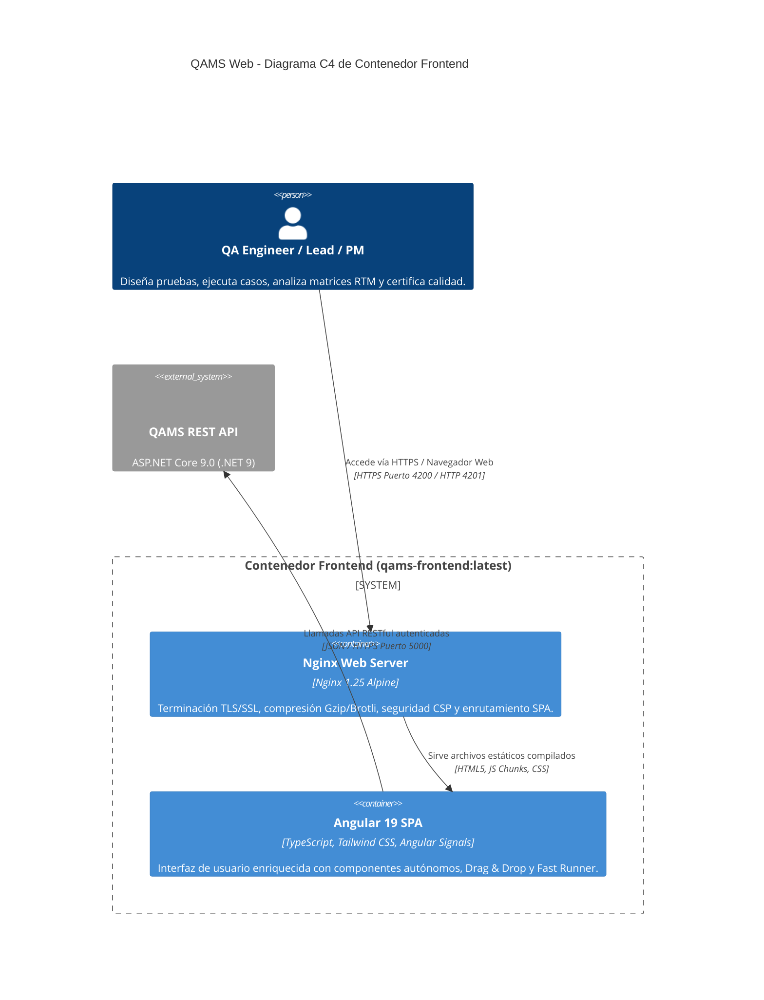
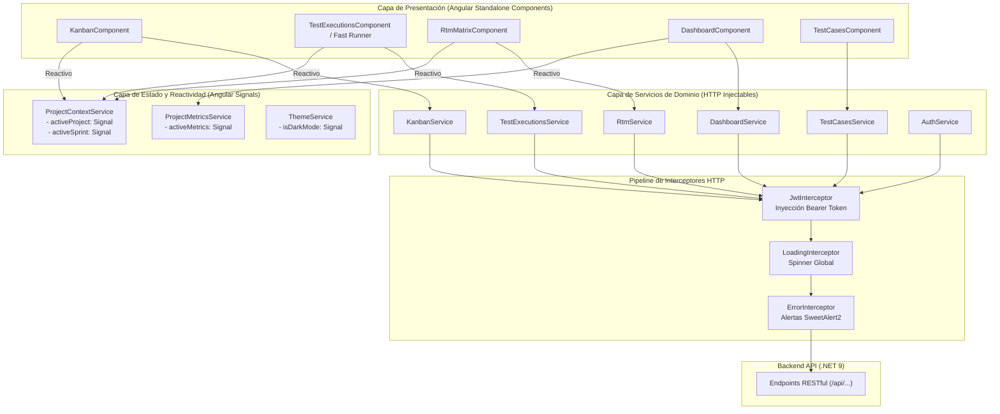
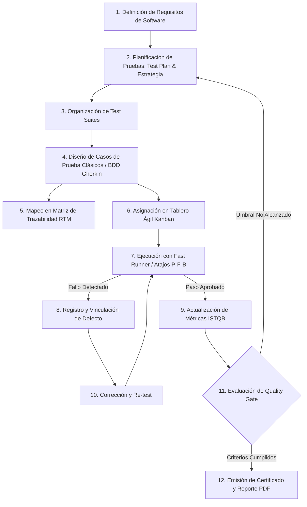
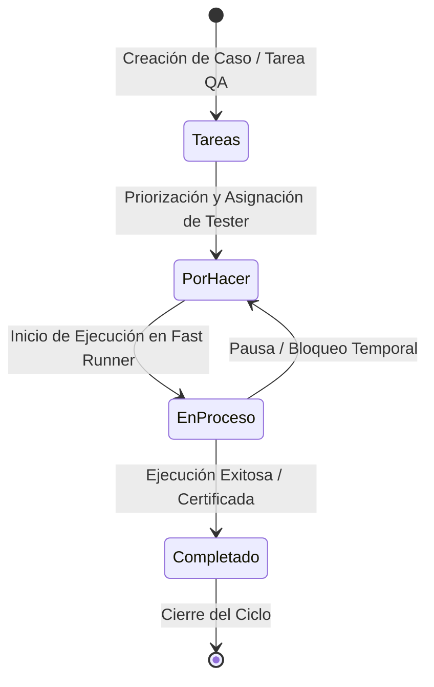
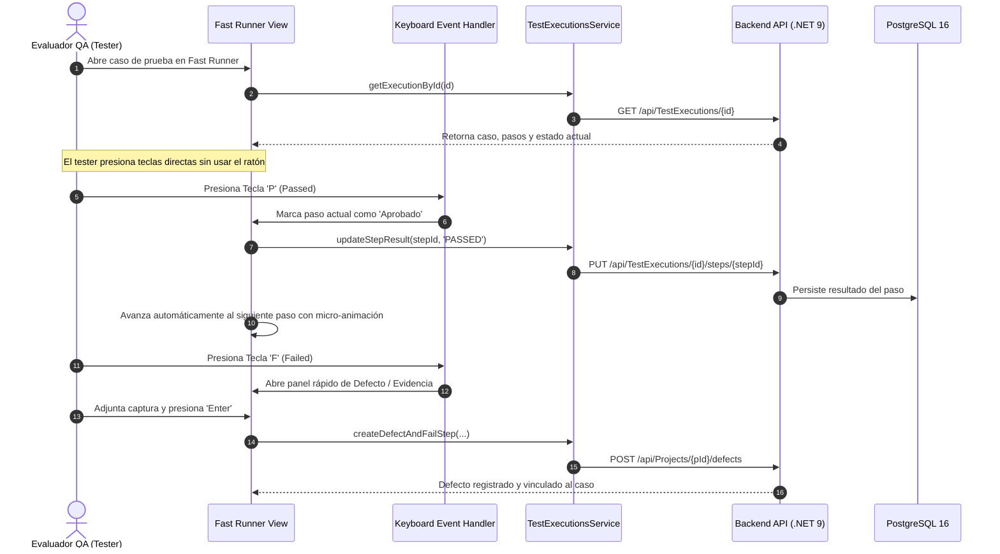
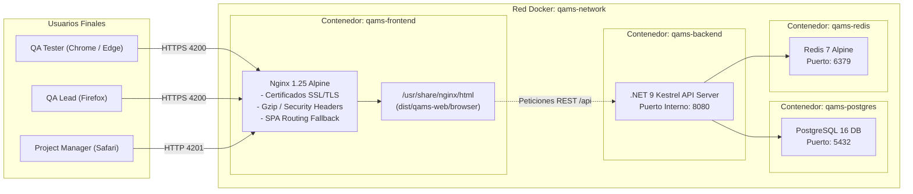

# 🛡️ QAMS Web — Frontend Single Page Application (SPA)
> **Plataforma Web Empresarial de Gestión del Ciclo de Vida de Pruebas de Software (STLC), Gobernanza de Calidad, Tablero Ágil Kanban Estandarizado y Conformidad Total con ISTQB® CTFL v4.0 e ISO/IEC/IEEE 29119**

[](https://angular.dev/)
[](https://www.typescriptlang.org/)
[](https://tailwindcss.com/)
[](https://www.istqb.org/)
[](https://www.iso.org/standard/64104.html)
[](https://nginx.org/)
[](https://www.docker.com/)
[](https://github.com/SecretWars007/qams-web)
[](LICENSE)

---

## 📑 Tabla de Contenidos
1. [Descripción General y Justificación del Proyecto](#1-descripción-general-y-justificación-del-proyecto)
   - [Justificación Técnica, Operativa y Económica](#11-justificación-del-proyecto)
   - [Objetivo General y Objetivos Específicos](#12-objetivos-del-proyecto)
   - [Benchmark Comparativo frente al Mercado (TCO y Capacidades)](#13-benchmark-comparativo-frente-a-herramientas-del-mercado)
   - [¿Por qué QAMS Web es la Mejor Opción?](#14-por-qué-qams-web-es-la-herramienta-definitiva-para-qa)
2. [Principios de Arquitectura del Frontend](#2-principios-de-arquitectura-del-frontend)
3. [Diagramas de Arquitectura, Despliegue y Flujos](#3-diagramas-de-arquitectura-despliegue-y-flujos)
   - [Diagrama C4 de Contenedor](#31-diagrama-c4-de-contenedor-frontend)
   - [Diagrama de Capas y Reactividad con Angular Signals](#32-diagrama-de-capas-y-reactividad-con-signals)
   - [Diagrama de Flujo del Ciclo de Vida STLC Completo](#33-diagrama-de-flujo-del-ciclo-de-vida-stlc-integral)
   - [Diagrama de Estados del Tablero Ágil Kanban](#34-diagrama-de-estados-del-tablero-ágil-kanban)
   - [Diagrama de Secuencia: Fast Runner de Ejecución](#35-diagrama-de-secuencia-motor-de-ejecución-rápida-fast-runner)
   - [Diagrama de Despliegue en Producción (Docker + Nginx TLS)](#36-diagrama-de-despliegue-en-producción-docker--nginx)
4. [Explicación Exhaustiva de Módulos Funcionales (18 Módulos)](#4-explicación-exhaustiva-de-módulos-funcionales)
5. [Sistema de Diseño (Emerald Sentinel UI / Dark Glassmorphism)](#5-sistema-de-diseño-emerald-sentinel-ui)
6. [Seguridad en el Cliente y Políticas de Red](#6-seguridad-en-el-cliente-y-políticas-de-red)
7. [Estructura del Proyecto y Árbol de Directorios](#7-estructura-del-proyecto-y-árbol-de-directorios)
8. [Stack Tecnológico Detallado](#8-stack-tecnológico-detallado)
9. [Instalación, Desarrollo y Despliegue](#9-instalación-desarrollo-y-despliegue)
10. [Control de Calidad, Compilación y Pruebas E2E](#10-control-de-calidad-compilación-y-pruebas-e2e)

---

## 1. Descripción General y Justificación del Proyecto

### 1.1 Justificación del Proyecto

En la ingeniería de software actual, el **Aseguramiento de la Calidad (QA)** y las pruebas de software representan la barrera crítica para evitar fallos catastróficos en producción. No obstante, una gran proporción de organizaciones continúan gestionando sus pruebas de forma artesanal mediante hojas de cálculo inconexas o se ven obligadas a pagar suscripciones mensuales prohibitivas en plataformas privativas en la nube.

Esta problemática genera:
1. **Pérdida de Trazabilidad:** Imposibilidad de auditar qué requisito de software está cubierto por qué caso de prueba y qué defectos derivaron de dicha ejecución.
2. **Brecha Metodológica con ISTQB:** Las herramientas genéricas de gestión de tareas (Jira, Trello) no implementan de forma nativa los conceptos formales de pruebas estáticas, inspecciones de pares, pruebas basadas en sesiones (SBTM), ni métricas estándar como DDR (*Defect Detection Rate*) o DRE (*Defect Removal Efficiency*).
3. **Fugas de Seguridad y Privacidad:** Almacenar evidencias de pruebas con datos sensibles en plataformas públicas de terceros compromete la soberanía de la información corporativa.
4. **Baja Productividad del Evaluador:** Formularios de ejecución lentos que obligan a realizar múltiples clics manuales por cada paso de prueba.

**QAMS Web** resuelve integralmente estas falencias entregando una **Single Page Application (SPA)** de nivel empresarial, autohospedada (*Self-Hosted*), con ergonomía optimizada para alta velocidad de ejecución, conformidad estricta con **ISTQB® CTFL v4.0** y **cero costos de licenciamiento por usuario**.

---

### 1.2 Objetivos del Proyecto

#### Objetivo General
Proveer una interfaz web empresarial fullstack reactiva, intuitiva y de alto rendimiento que digitalice, centralice y audite de extremo a extremo el ciclo de vida de pruebas de software (STLC), garantizando trazabilidad total bidireccional desde los requisitos del sistema hasta los defectos en producción bajo estándares internacionales de calidad.

#### Objetivos Específicos
1. **Implementar una Matriz de Trazabilidad de Requisitos (RTM) Bidireccional:** Visualizar en tiempo real las relaciones $M:N$ entre Requisitos $\leftrightarrow$ Casos de Prueba $\leftrightarrow$ Ejecuciones $\leftrightarrow$ Defectos, alertando sobre brechas de cobertura (*Gaps*).
2. **Acelerar la Ejecución mediante Fast Runner:** Reducir los tiempos de registro de resultados en más del 60% mediante una interfaz guiada con atajos de teclado (`P` para Passed, `F` para Failed, `B` para Blocked).
3. **Estandarizar el Flujo de Trabajo con Tablero Kanban Universal:** Disponer de un tablero ágil inmutable de 4 columnas (*Tareas*, *Por Hacer*, *En Proceso*, *Completado*) con sincronización transaccional en base de datos.
4. **Soportar Pruebas Estáticas y Revisiones de Pares:** Integrar un módulo formal para sesiones de inspección de especificaciones y código conforme al método de Fagan.
5. **Gestionar Pruebas Exploratorias Basadas en Sesiones (SBTM):** Facilitar la creación de cartas de prueba (*Charters*), control de tiempo de sesión y registro estructurado de hallazgos.
6. **Automatizar la Certificación con Quality Gates:** Evaluar algorítmicamente si un proyecto cumple los umbrales de cobertura y tasa de éxito para ser promovido a producción.
7. **Garantizar Cero Mocks y Tolerancia Cero a Fallbacks:** Todo el ecosistema de componentes se comunica de forma estricta y en tiempo real contra los endpoints del backend API.

---

### 1.3 Benchmark Comparativo frente a Herramientas del Mercado

| Criterio de Evaluación | QAMS Web (Propuesta) | TestRail (Idera) | Zephyr Scale (SmartBear) | Jira Xray (Ibis) | TestLink (Open Source) |
|---|---|---|---|---|---|
| **Modelo de Licencia** | **Open Source / Self-Hosted** | Comercial SaaS / Server | Plugin Comercial Jira | Plugin Comercial Jira | GPL Open Source Legado |
| **Costo Anual (15 Testers)** | **$0 USD (Infra Propia)** | $6,660 USD / año | $4,500 USD / año | $3,600 USD / año | $0 USD |
| **Costo a 5 Años (TCO)** | **$2,100 USD (Servidor)** | $33,300 USD | $22,500 USD | $18,000 USD | $2,100 USD |
| **Ahorro Financiero** | **93.7% Ahorro ⭐** | 0% (Base) | 32.4% | 45.9% | 93.7% |
| **Conformidad ISTQB CTFL v4.0** | **100% Nativo ⭐** | 72% Parcial | 68% Parcial | 74% Parcial | 48% Básico |
| **Pruebas Estáticas / Inspección** | **Nativo Integrado ⭐** | No Soportado | No Soportado | No Soportado | No Soportado |
| **Pruebas Exploratorias (SBTM)** | **Nativo con Charters ⭐** | Básico (Notas) | Requiere Extensión | Soportado | No Soportado |
| **Soporte BDD Gherkin Nativo** | **Nativo Integrado ⭐** | Plugin Externo | Soportado | Nativo | No Soportado |
| **Motor de Ejecución Rápida** | **Fast Runner (Teclado P/F/B)** | Test Run Clásico | Test Player | Execution Modal | Formulario Clásico |
| **Tablero Kanban Estandarizado** | **Nativo 4 Columnas ⭐** | No Soportado | Requiere Jira Boards | Requiere Jira Boards | No Soportado |
| **Certificación Quality Gates** | **Nativo Programático ⭐** | Hitos manuales | Reporte manual | Reporte manual | No Soportado |
| **Stack y Modernidad** | **Angular 19 + Signals** | PHP / React Clásico | Java / React Jira | Java / React Jira | PHP 5/7 (Deprecado) |

---

### 1.4 ¿Por qué QAMS Web es la Herramienta Definitiva para QA?

1. **Alineación 100% Teórica y Práctica con ISTQB:** Concebida desde su modelo de datos y diseño UX para satisfacer los requerimientos de certificación y auditorías de calidad internacional.
2. **Soberanía y Máxima Confidencialidad:** Despliegue bajo control total del cliente mediante Docker, evitando la exposición de vulnerabilidades o credenciales en servidores de terceros.
3. **Ergonomía de Alto Rendimiento:** Menor cantidad de clics por acción operativa, interfaces oscuras diseñadas contra la fatiga visual (*Emerald Sentinel Glassmorphism*) y atajos de teclado globales.
4. **Transparencia Arquitectónica:** Código limpio, sin dependencias propietarias opacas, completamente modular y extensible.

---

## 2. Principios de Arquitectura del Frontend

* **Arquitectura Basada en Componentes Autónomos (*Standalone-First*)**: Supresión total de módulos (`NgModule`), reduciendo la complejidad del árbol de inyección y optimizando el *Tree-Shaking*.
* **Gestión de Estado Reactivo con Angular Signals**: Adopción de la reactividad fina de Angular (`signal`, `computed`, `effect`) en lugar de depender exclusivamente de suscripciones manuales a `BehaviorSubject`, logrando renderizados atómicos con cero penalización en Zone.js.
* **Separación Estricta de Capas**:
  - **Presentación (`features/`)**: Vistas puras, interacción con el usuario y captura de eventos.
  - **Contexto de Estado Compartido (`core/services/project-context.service.ts`)**: Señales globales que notifican cambios de proyecto o sprint activo a todos los módulos en milisegundos.
  - **Red y Transporte (`core/services/`, `core/interceptors/`)**: Abstracción del protocolo HTTP con tipado estricto mediante DTOs y modelos TypeScript.
* **Política de Cero Mocks (Zero-Mock Assurance)**: Todas las operaciones CRUD y de consulta ejecutan peticiones reales contra el backend .NET 9.

---

## 3. Diagramas de Arquitectura, Despliegue y Flujos

### 3.1 Diagrama C4 de Contenedor (Frontend)



---

### 3.2 Diagrama de Capas y Reactividad con Signals



---

### 3.3 Diagrama de Flujo del Ciclo de Vida STLC Integral



---

### 3.4 Diagrama de Estados del Tablero Ágil Kanban



---

### 3.5 Diagrama de Secuencia: Motor de Ejecución Rápida (Fast Runner)



---

### 3.6 Diagrama de Despliegue en Producción (Docker + Nginx)



---

## 4. Explicación Exhaustiva de Módulos Funcionales

QAMS Web integra **18 módulos especializados**, diseñados de forma modular y con componentes autónomos:

### 1. 🗂️ Módulo Kanban Ágil (`features/kanban/`)
* **Estandarización en 4 Columnas**:
  1. `Tareas` (`col-backlog`): Casos de prueba en fase de diseño o preparación.
  2. `Por Hacer` (`col-todo`): Tareas listas y priorizadas para el ciclo actual.
  3. `En Proceso` (`col-in-progress`): Ejecución activa con pulso visual esmeralda.
  4. `Completado` (`col-done`): Pruebas completadas, verificadas y cerradas.
* **Drag & Drop Transaccional**: Reordenamiento mediante `@angular/cdk/drag-drop` que sincroniza el `backendColumnId` real contra la base de datos PostgreSQL.
* **Bento Summary Strip**: Barra de métricas con selector reactivo de proyecto, selector de sprint, barra de porcentaje de avance y contadores rápidos de tareas.
* **Filtros Dinámicos**: Búsqueda por código (`QA-TASK-001`), título, tester asignado, nivel de prioridad y etiquetas.

### 2. ⚡ Módulo Fast Runner de Ejecuciones (`features/test-executions/`)
* **Ejecución Asistida por Teclado**: Atajos globales (`P` = Passed, `F` = Failed, `B` = Blocked) para calificar pasos sin usar el ratón.
* **Avance Automático de Pasos**: Al calificar un paso, la interfaz desplaza el foco suavemente al siguiente elemento.
* **Inyección de Evidencias en Caliente**: Carga de capturas y logs de error vinculados directamente al paso fallido.

### 3. 📋 Módulo Matriz de Trazabilidad RTM (`features/reports/rtm-matrix/`)
* **Matriz Bidireccional $M:N$**: Mapeo visual e interactivo entre Requisitos $\leftrightarrow$ Casos de Prueba $\leftrightarrow$ Ejecuciones $\leftrightarrow$ Defectos.
* **Indicador de Cobertura ISTQB**: Porcentaje de requisitos cubiertos y detección inmediata de requisitos huérfanos (*Gaps*).

### 4. 📝 Módulo de Casos de Prueba y BDD (`features/test-cases/`)
* **Editor Clásico y BDD (Gherkin)**: Redacción formal con bloques estructurados `Dado que`, `Cuando`, `Entonces`.
* **Clasificación ISTQB**: Tipos de prueba (Funcional, Regresión, Humo, Integración, Seguridad, Rendimiento) y niveles de severidad/prioridad.
* **Pasos Detallados**: Definición de precondiciones, datos de entrada y resultados esperados por paso.

### 5. 👥 Módulo de Revisiones Estáticas e Inspecciones (`features/reviews/`)
* **Inspecciones de Pares (Método de Fagan)**: Planificación y ejecución de sesiones formales de revisión de especificaciones y código.
* **Registro de Hallazgos Estáticos**: Bitácora de defectos detectados antes de la ejecución dinámica, clasificando regla violada, severidad y tiempo invertido.

### 6. 🧭 Módulo de Pruebas Exploratorias SBTM (`features/exploratory/`)
* **Session-Based Test Management**: Cartas de prueba (*Charters*) con misión, objetivos y límites de tiempo definidos.
* **Bitácora de Sesión**: Registro en tiempo real de notas, observaciones y hallazgos descubiertos durante la exploración libre.

### 7. 📑 Módulo de Planes de Prueba (`features/test-plans/`)
* **Estrategia y Alcance**: Documentación formal del alcance, recursos, entornos y criterios de aceptación conforme a **ISO/IEC/IEEE 29119-3**.
* **Flujo de Aprobación**: Ciclo de vida del plan (*Draft*, *In Review*, *Approved*, *Archived*).

### 8. 📦 Módulo de Suites y Escenarios (`features/test-scenarios/`)
* **Agrupación Modular**: Organización lógica de casos de prueba por subsistemas, módulos o flujos de negocio.

### 9. 🐛 Módulo de Gestión de Defectos (`features/defects/`)
* **Ciclo de Vida del Defecto**: Estados (*New*, *Open*, *In Progress*, *Resolved*, *Retest*, *Closed*, *Rejected*).
* **Vigencia y Severidad**: Clasificación por impacto en el negocio (Bloqueante, Crítico, Mayor, Menor, Trivial) con enlaces a evidencias multimedia.

### 10. 🎯 Módulo de Requisitos de Software (`features/requirements/`)
* **Catálogo de Requerimientos**: Gestión de requerimientos funcionales y no funcionales con versión y prioridad.

### 11. 💻 Módulo de Sistemas Bajo Prueba SUT (`features/systems-under-test/`)
* **Sistemas y Plataformas**: Registro de aplicaciones bajo prueba con categorización normalizada de plataformas (Web, Android, iOS, API REST, Desktop).

### 12. 📊 Módulo Dashboard Ejecutivo y KPIs (`features/dashboard/`)
* **Métricas de Calidad ISTQB**: DDR (*Defect Detection Rate*), DRE (*Defect Removal Efficiency*), MTTR (*Mean Time to Repair*).
* **Gráficos Interactivos**: Curvas Burndown y Drawdown por ciclo.

### 13. 🛡️ Módulo de Quality Gates (`features/reports/quality-gate-widget/`)
* **Evaluación Automatizada de Criterios de Salida**: Verificación programática de umbrales (% de casos aprobados, 0 defectos bloqueantes) para emitir la certificación de despliegue.

### 14. 📄 Módulo de Reportes Ejecutivos en PDF (`features/reports/`)
* **Emisión Técnica de Reportes**: Exportación de reportes ejecutivos consolidados con firma técnica y detalle de ejecución generados mediante Chromium headless.

### 15. 🖼️ Módulo de Evidencias Multimedia (`features/evidences/`)
* **Galería y Lightbox**: Visor interactivo de capturas de pantalla, archivos adjuntos y logs de ejecución con zoom y descarga directa.

### 16. 🔐 Módulo de Administración y RBAC (`features/admin/`)
* **Gestión Granular de Seguridad**: Control de Usuarios, Roles empresariales y matriz de permisos del sistema (`USERS_MANAGE`, `TESTS_EXECUTE`, `REPORTS_VIEW`, etc.).

### 17. 🔑 Módulo de API Keys (`features/admin/api-keys/`)
* **Integración CI/CD**: Generación y revocación de credenciales seguras para integración con pipelines de GitHub Actions, GitLab CI y Azure DevOps.

### 18. 🌐 Módulo de Autenticación y Perfil (`features/auth/`, `features/profile/`)
* **Seguridad y Preferencias**: Login con diseño *Split Screen*, registro, recuperación de contraseña, cambio seguro de credenciales y personalización del perfil de usuario.

---

## 5. Sistema de Diseño (Emerald Sentinel UI)

QAMS Web incorpora el sistema de diseño visual **Emerald Sentinel**, concebido específicamente para reducir la fatiga ocular en jornadas intensivas de testing:

* **Paleta de Fondos (Deep Navy Glassmorphism)**:
  - Base Principal: `#0b1421`
  - Contenedores y Cards: `#0e1a2b` con bordes sutiles `rgba(255, 255, 255, 0.08)`
  - Encabezados de Columna: `#111e30`
* **Colores Semánticos de Estado**:
  - `Passed` / `Completado`: Esmeralda Luminoso (`#10b981` / `#34d399`)
  - `In Progress` / `En Proceso`: Ámbar Dorado (`#f59e0b` / `#fbbf24`)
  - `Failed` / `Bloqueante`: Rojo Rubí (`#ef4444` / `#f87171`)
  - `Blocked` / `Pausado`: Púrpura Orquídea (`#a855f7` / `#c084fc`)
  - `Backlog` / `Tareas`: Slate Plateado (`#86948a` / `#cbd5e1`)
* **Tipografía**: Fuentes modernas *Inter* y *JetBrains Mono* (para bloques de código BDD y snippets).

---

## 6. Seguridad en el Cliente y Políticas de Red

1. **Autenticación Stateless con JWT**: Interceptor `JwtInterceptor` que adjunta automáticamente el token `Bearer` a cada solicitud saliente y gestiona la expiración con cierre de sesión seguro.
2. **Guard de Permisos (`PermissionGuard`)**: Validación declarativa en el enrutador de Angular para impedir la navegación no autorizada a módulos restringidos.
3. **Protección Contra Inyecciones (XSS)**: Sanitización automática de plantillas con `DomSanitizer` de Angular.
4. **Cabeceras de Seguridad Nginx**:
   - `Content-Security-Policy (CSP)`
   - `X-Frame-Options: SAMEORIGIN`
   - `X-Content-Type-Options: nosniff`
   - `Referrer-Policy: strict-origin-when-cross-origin`

---

## 7. Estructura del Proyecto y Árbol de Directorios

```
qams-web/
├── src/
│   ├── app/
│   │   ├── core/                        # Núcleo transversal de la aplicación
│   │   │   ├── dto/                     # Data Transfer Objects fuertemente tipados
│   │   │   ├── guards/                  # AuthGuard, PermissionGuard
│   │   │   ├── interceptors/            # JwtInterceptor, ErrorInterceptor, LoadingInterceptor
│   │   │   ├── mappers/                 # Mappers bidireccionales DTO <-> Model
│   │   │   ├── models/                  # Entidades de dominio TypeScript
│   │   │   └── services/                # 26 Servicios HTTP (Conexión directa a API)
│   │   ├── features/                    # 18 Módulos funcionales de la aplicación
│   │   │   ├── admin/                   # Usuarios, Roles, Catálogos, ApiKeys
│   │   │   ├── auth/                    # Login, Registro, Recuperación de contraseña
│   │   │   ├── dashboard/               # Dashboard analítico y KPIs ISTQB
│   │   │   ├── defects/                 # Control de defectos y severidades
│   │   │   ├── evidences/               # Galería y visor de evidencias multimedia
│   │   │   ├── exploratory/             # Sesiones exploratorias (SBTM)
│   │   │   ├── kanban/                  # Tablero ágil QA de 4 columnas
│   │   │   ├── profile/                 # Modal de perfil de usuario
│   │   │   ├── projects/                # Proyectos y Sistemas Bajo Prueba (SUT)
│   │   │   ├── reports/                 # Generación de reportes PDF y RTM Matrix
│   │   │   ├── requirements/            # Requisitos funcionales y no funcionales
│   │   │   ├── reviews/                 # Revisiones estáticas de pares
│   │   │   ├── shared/                  # Componentes compartidos (Badge, DataTable, Modal)
│   │   │   ├── systems-under-test/      # Gestión de SUT y tipos de plataforma
│   │   │   ├── test-cases/              # Casos de prueba clásicos y BDD
│   │   │   ├── test-environments/       # Catálogo de entornos de prueba
│   │   │   ├── test-executions/         # Fast Runner y ejecuciones en vivo
│   │   │   ├── test-plans/              # Planes de prueba y aprobación
│   │   │   └── test-scenarios/          # Suites de prueba y escenarios
│   │   ├── layouts/                     # MainLayout (Sidebar, Navbar, Selector de Contexto)
│   │   └── shared/                      # Componentes reutilizables (Badge, Table, Dialog)
│   ├── environments/                    # Variables de entorno (Dev, Docker, Prod)
│   ├── styles.scss                      # Estilos globales y tokens del sistema de diseño
│   └── main.ts                          # Punto de entrada de la SPA Angular
├── Dockerfile                           # Construcción multi-stage de producción en Nginx
├── nginx.conf                           # Configuración optimizada de Nginx con SSL/TLS
├── playwright.config.ts                 # Configuración de pruebas E2E con Playwright
├── tailwind.config.js                   # Configuración del motor Tailwind CSS
└── package.json                         # Dependencias y scripts del proyecto
```

---

## 8. Stack Tecnológico Detallado

| Herramienta / Paquete | Versión | Propósito Arquitectónico |
|---|---|---|
| **Angular** | `19.1.0` | Framework SPA basado en Componentes Autónomos y Signals |
| **TypeScript** | `5.7.2` | Lenguaje fuertemente tipado con validación estricta |
| **Tailwind CSS** | `3.4.17` | Utilidades de estilizado atómico y diseño responsivo |
| **Angular CDK** | `19.1.0` | Utilidades de Drag & Drop y accesibilidad |
| **Remix Icon** | `4.6.0` | Librería completa de iconografía vectorial |
| **SweetAlert2** | `11.6.13` | Modales y cuadros de diálogo interactivos |
| **Playwright** | `1.50.0` | Framework de pruebas automatizadas End-to-End |
| **Nginx Alpine** | `1.25` | Servidor web HTTP/2 y proxy inverso con soporte TLS |

---

## 9. Instalación, Desarrollo y Despliegue

### Requisitos Previos
* **Node.js**: `v20.x` LTS o superior
* **npm**: `v10.x` o superior
* **Docker Desktop**: `v24.x` o superior

### 1. Ejecución Local en Modo Desarrollo

```bash
# 1. Clonar el repositorio
git clone https://github.com/SecretWars007/qams-web.git
cd qams-web

# 2. Instalar dependencias
npm install

# 3. Iniciar el servidor local de desarrollo
npm start
```
> La aplicación estará disponible en `http://localhost:4200`.

### 2. Despliegue con Docker Compose (Ecosistema Completo)

```bash
# Construir la imagen y levantar el contenedor de frontend
docker compose up -d --build frontend

# Verificar el estado y salud del contenedor
docker ps --filter "name=qams-frontend"
```
* **Acceso Seguro HTTPS**: `https://localhost:4200`
* **Acceso HTTP**: `http://localhost:4201`

---

## 10. Control de Calidad, Compilación y Pruebas E2E

```bash
# Compilación para producción (AOT, Tree-shaking y minificación)
npm run build

# Ejecutar suite de pruebas de extremo a extremo (E2E) con Playwright
npx playwright test
```

---

## 📄 Licencia

Este proyecto está bajo la Licencia **MIT**. Para más detalles, consulta el archivo [LICENSE](LICENSE).
