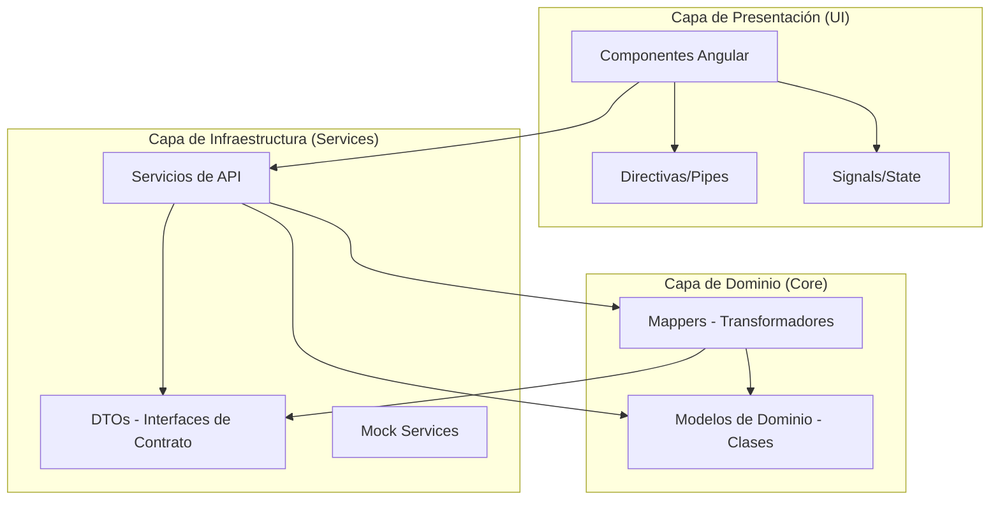
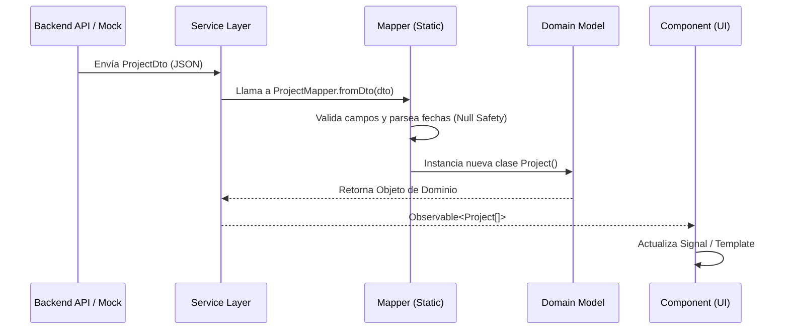

# QAMS - Quality Assurance Management System


## 📝 Descripción del Proyecto

**QAMS** es una plataforma empresarial de vanguardia diseñada para centralizar, gestionar y optimizar el ciclo de vida del aseguramiento de calidad (QA). Construida con **Angular 19**, la aplicación ofrece una interfaz premium, altamente responsiva y orientada al rendimiento, proporcionando a los equipos de QA una herramienta poderosa para el seguimiento de proyectos, ejecución de casos de prueba y visualización de métricas en tiempo real.

El sistema se distingue por su enfoque en la **Arquitectura Limpia (Clean Architecture)**, garantizando una separación clara entre la lógica de negocio, los contratos de datos (DTOs) y la capa de presentación.

---

## 🎯 Objetivos

### Objetivo General
Desarrollar una interfaz de usuario profesional y robusta que permita la gestión eficiente de procesos de calidad, facilitando la toma de decisiones basada en datos mediante un dashboard analítico y una estructura de datos estandarizada.

### Objetivos Específicos
1.  **Implementar Clean Architecture**: Separar las entidades de dominio de los modelos de transferencia de datos (DTOs) mediante una capa de mapeo dedicada.
2.  **Garantizar Fiabilidad de Datos**: Implementar mecanismos de *null-safety* y validaciones en la transformación de datos para evitar errores de tiempo de ejecución.
3.  **Optimizar la UX/UI**: Crear una experiencia de usuario premium utilizando principios de *Glassmorphism*, tipografía moderna (**Inter**) y un sistema de diseño cohesivo.
4.  **Fomentar la Escalabilidad**: Utilizar componentes autónomos (*Standalone Components*) y servicios reactivos con RxJS y Angular Signals.
5.  **Asegurar la Responsividad**: Desarrollar una interfaz adaptativa que funcione perfectamente en resoluciones móviles, tablets y desktop.

---

## 🏗️ Arquitectura del Sistema

El proyecto sigue una estructura basada en dominios y capas, asegurando que la interfaz de usuario nunca dependa directamente de los cambios en los contratos de la API.

### Diagrama de Capas (Arquitectura Limpia)



### Flujo de Datos (Mapping Flow)



---

## 🛠️ Stack Tecnológico

-   **Framework**: Angular 19+ (Standalone)
-   **Lenguaje**: TypeScript (Strict Mode)
-   **Estilos**: Tailwind CSS 3+ & Vanilla CSS
-   **Estado**: Angular Signals & RxJS
-   **Gráficos**: Chart.js con ng2-charts
-   **Iconografía**: FontAwesome 6 Pro
-   **Tipografía**: Inter (Premium Typography)

---

## 📦 Módulos Principales

1.  **Dashboard**: Visualización interactiva de KPIs, tasa de aprobación (Pass Rate), progreso Kanban y cronogramas de ejecución.
2.  **Proyectos**: Gestión integral de proyectos con estados, prioridades y registro de devoluciones.
3.  **Escenarios y Casos**: Estructura jerárquica para la definición de pruebas, pasos detallados y condiciones previas.
4.  **Ejecuciones**: Motor de ejecución de pruebas con seguimiento de tiempo real y estados dinámicos.
5.  **Tablero Kanban**: Gestión visual de tareas QA mediante drag-and-drop.
6.  **Administración**: Control de acceso basado en roles (RBAC), gestión de usuarios y catálogos maestros.

---

## 🚀 Instalación y Desarrollo

### Prerrequisitos
-   Node.js (LTS recomendado)
-   Angular CLI `npm install -g @angular/cli`

### Pasos
1.  Clonar el repositorio.
2.  Instalar dependencias:
    ```bash
    npm install
    ```
3.  Configurar entorno:
    Asegurarse de que `environment.ts` apunta a la API correcta o activar `useMock: true` para desarrollo local sin backend.
4.  Ejecutar el servidor de desarrollo:
    ```bash
    npm start
    ```
5.  Acceder a `http://localhost:4200`.

---
*Desarrollado con ❤️ por el equipo de QA Engineering.*
