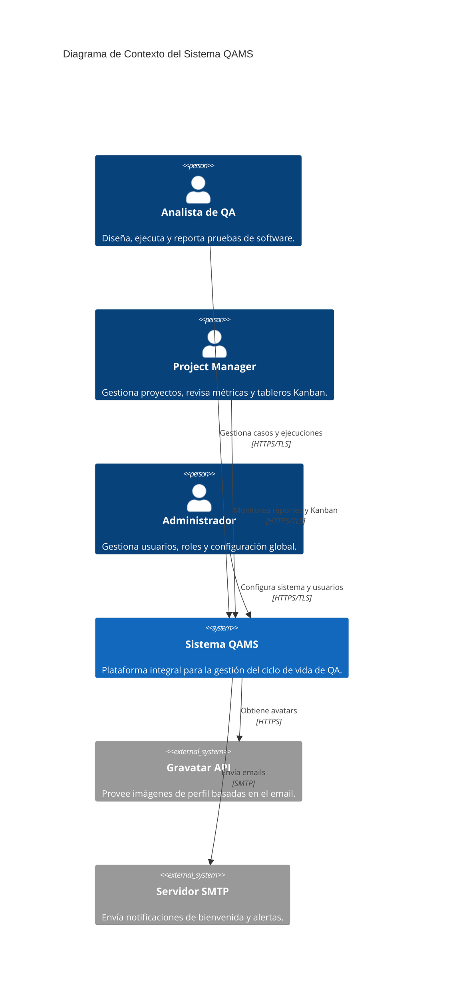
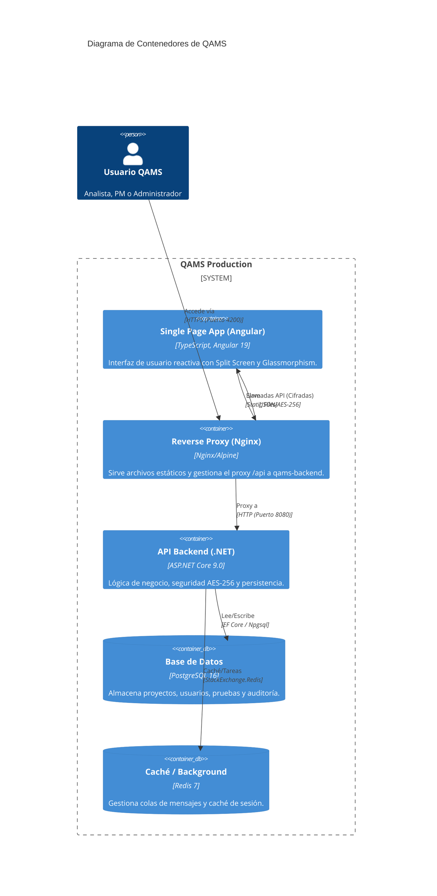
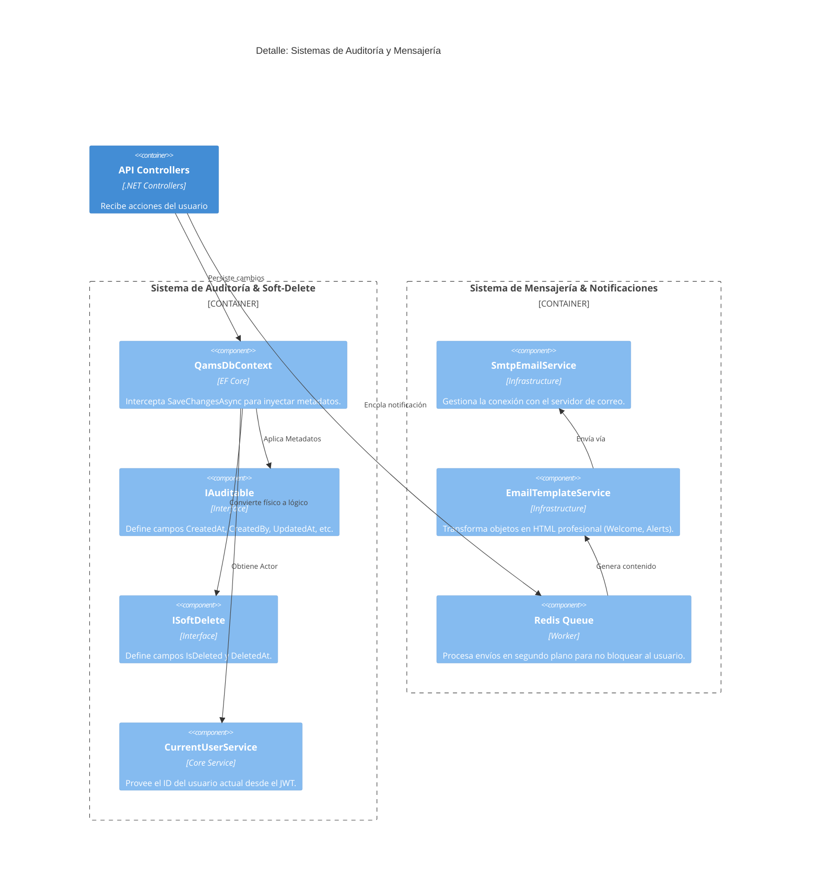
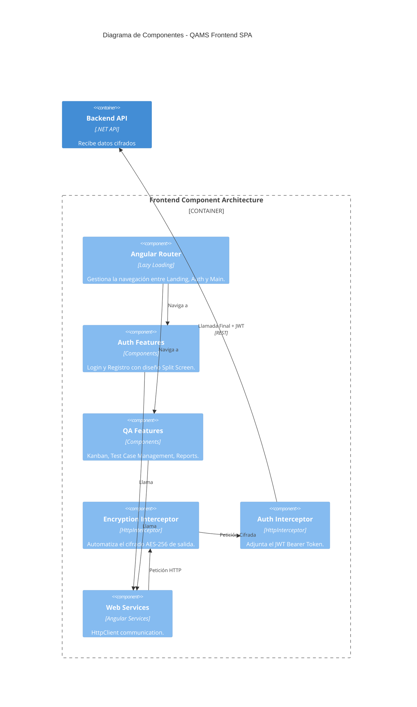

# Arquitectura C4 - QAMS (Quality Assurance Management System)

Este documento detalla la arquitectura del sistema QAMS utilizando el modelo C4 para proporcionar diferentes niveles de abstracción.

## Nivel 1: Contexto del Sistema

## Nivel 2: Contenedores

## Nivel 3: Detalle de Componentes Cross-Cutting (Auditoría y Mensajería)

Este diagrama profundiza en cómo el sistema gestiona la persistencia segura y las notificaciones.

## Nivel 3: Componentes (Frontend SPA)

---
**Desarrollado por:** Antigravity AI para QAMS Project.
**Modelo:** C4 Architecture v1.1 (Detailed Audit & Messaging)
