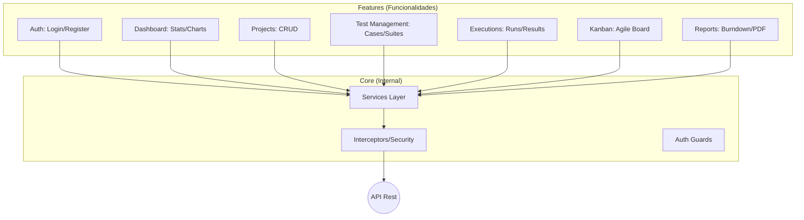
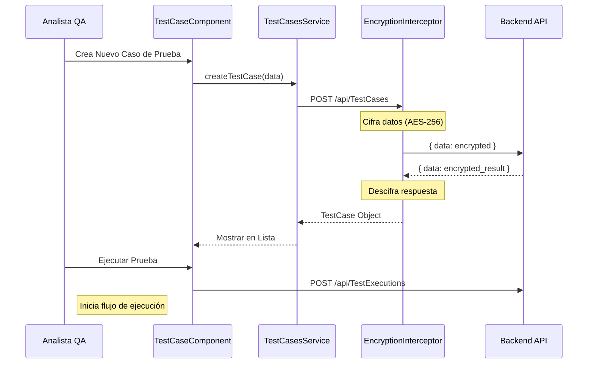
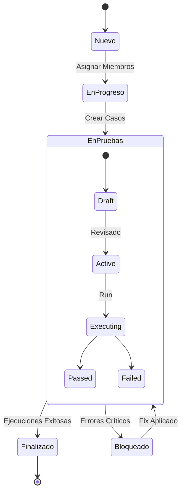
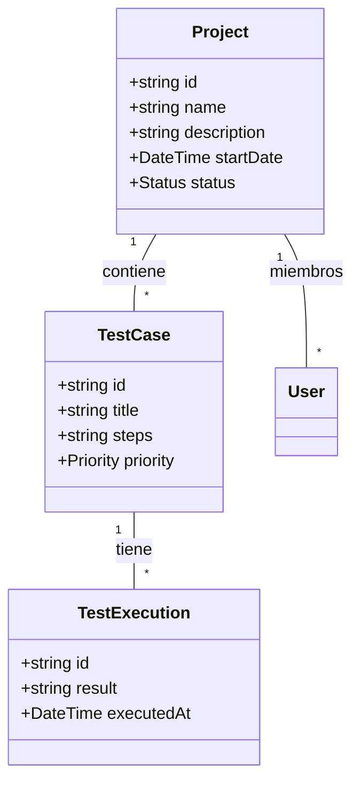

# Documentación UML Completa - QAMS Frontend

Este documento proporciona una visión integral de 360 grados de todas las funcionalidades del frontend de QAMS, incluyendo la gestión de pruebas, reportes, tableros ágiles y seguridad cifrada.

## 1. Diagrama de Casos de Uso (Módulos Completos)

Representa las acciones que los diferentes roles pueden realizar en el sistema.

```mermaid
useCaseDiagram
    actor "Administrador" as Admin
    actor "Analista de QA" as QA
    actor "Project Manager" as PM

    package "Autenticación y Perfil" {
        usecase "Login / Registro" as UC1
        usecase "Editar Perfil (Gravatar)" as UC2
        usecase "Gestionar Roles" as UC3
    }

    package "Gestión de Proyectos" {
        usecase "Crear/Editar Proyecto" as UC4
        usecase "Ver Dashboard de Estadísticas" as UC5
        usecase "Visualizar Kanban" as UC6
    }

    package "Gestión de Pruebas (Core QA)" {
        usecase "Gestionar Casos de Prueba" as UC7
        usecase "Diseñar Escenarios de Prueba" as UC8
        usecase "Ejecutar Pruebas" as UC9
        usecase "Ver Reportes Burndown" as UC10
    }

    QA --> UC1
    QA --> UC2
    QA --> UC7
    QA --> UC8
    QA --> UC9

    PM --> UC4
    PM --> UC5
    PM --> UC6
    PM --> UC10

    Admin --> UC3
    Admin --> UC4
```

## 2. Diagrama de Arquitectura de Módulos (Package Diagram)

Mapeo de la estructura de archivos en `src/app/features/` y su relación con el core.



## 3. Diagrama de Secuencia: Ciclo de Vida de una Prueba (QA Flow)

Muestra la interacción desde la creación de un caso hasta su ejecución.



## 4. Diagrama de Estados: Proyectos y Pruebas



## 5. Diagrama de Clase: Entidades de Negocio (Modelos)



---
**Desarrollado para:** QAMS (Quality Assurance Management System)
**Documento:** Integral UML v2.0
