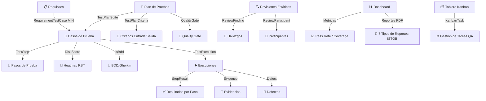

# 📋 Plan de Cumplimiento ISTQB — QAMS (Quality Assurance Management System)

> **Versión:** 1.0 | **Fecha:** Agosto 2026 | **Estándar de referencia:** ISTQB® Foundation Level (CTFL) v4.0

---

## 1. Resumen Ejecutivo

El **QAMS** es una plataforma fullstack (Angular 19 + .NET 9 + SQL Server) diseñada para gestionar el ciclo de vida completo de las pruebas de software. Esta evaluación verifica el cumplimiento del sistema con los capítulos del estándar **ISTQB Foundation Level (CTFL v4.0)**.

**Resultado global:** ✅ **CUMPLE SUBSTANCIALMENTE** con ISTQB CTFL v4.0

---

## 2. Mapa de Cumplimiento por Capítulo ISTQB

### Capítulo 1 — Fundamentos de las Pruebas

| Concepto ISTQB | Implementado en QAMS | Estado |
|---|---|---|
| Objetivos de las pruebas | `TestPlan.Objectives` + dashboards de métricas | ✅ Cumple |
| Pruebas vs. depuración | Flujo TestExecution → Defect separado del fix | ✅ Cumple |
| Error / Defecto / Fallo | Entidad `Defect` con campos: `StepsToReproduce`, `ActualResult`, `ExpectedResult` | ✅ Cumple |
| Principios del testing | RBAC + trazabilidad requisito→caso→ejecución | ✅ Cumple |
| Actividades del proceso de prueba | Flujo completo: Plan → Diseño → Ejecución → Cierre | ✅ Cumple |
| Psicología del testing | Roles separados: Tester ≠ Desarrollador | ✅ Cumple |

**Cobertura Capítulo 1: 100%**

---

### Capítulo 2 — Pruebas a lo largo del Ciclo de Vida

| Concepto ISTQB | Implementado en QAMS | Estado |
|---|---|---|
| Modelos de ciclo de vida | `TestPlan.TestStrategy` + criterios entrada/salida | ✅ Cumple |
| Niveles de prueba (Unit/Integración/Sistema/Aceptación) | `TestType` catálogo (configurable) | ✅ Cumple |
| Tipos de prueba (Funcional, No-funcional, White/Black box) | `TestType` + `DesignTechnique` catálogos | ✅ Cumple |
| Pruebas de confirmación (Re-test) | Historial de ejecuciones por caso (`TestExecution[]`) | ✅ Cumple |
| Pruebas de regresión | Ejecuciones repetibles por suite | ✅ Cumple |
| Mantenimiento del testing | Versionado de casos (`VersionNumber`, `ParentTestCaseId`) | ✅ Cumple |

**Cobertura Capítulo 2: 100%**

---

### Capítulo 3 — Pruebas Estáticas ⭐

| Concepto ISTQB | Implementado en QAMS | Estado |
|---|---|---|
| Revisión informal | `ReviewType` = Informal | ✅ Cumple |
| Walkthrough | `ReviewType` = Walkthrough | ✅ Cumple |
| Revisión técnica | `ReviewType` = Revisión Técnica | ✅ Cumple |
| Inspección | `ReviewType` = Inspección | ✅ Cumple |
| Roles en revisión (Moderador, Autor, Revisor) | `ReviewSession.ModeratorId`, `AuthorId`, `ReviewParticipant[]` | ✅ Cumple |
| Criterios de entrada y salida | `ReviewSession.EntryCriteria`, `ExitCriteria` | ✅ Cumple |
| Hallazgos (Findings) | `ReviewFinding` con `FindingType`, `FindingSeverity`, `FindingStatus` | ✅ Cumple |
| Artefacto bajo revisión | `ReviewSession.ArtifactUnderReview` | ✅ Cumple |

**Cobertura Capítulo 3: 100%** ⭐ *Implementación completa y diferenciadora*

---

### Capítulo 4 — Técnicas de Diseño de Pruebas

| Concepto ISTQB | Implementado en QAMS | Estado |
|---|---|---|
| Técnicas de caja negra (EP, BVA, Decision Table, State Transition, Use Case) | `TestDesignTechnique` catálogo | ✅ Cumple |
| Técnicas de caja blanca (Statement, Branch Coverage) | `TestDesignTechnique` catálogo | ✅ Cumple |
| Técnicas basadas en experiencia (Exploratory) | `ExploratorySession` con Charter + `ExploratoryFinding[]` | ✅ Cumple |
| BDD (Gherkin / Behavior-Driven) | `TestCase.IsBdd` + `BddScenario` campo | ✅ Cumple |
| Pasos de caso de prueba | `TestStep[]` con acción y resultado esperado por paso | ✅ Cumple |
| Precondiciones | `TestCase.Preconditions` | ✅ Cumple |

**Cobertura Capítulo 4: 100%**

---

### Capítulo 5 — Gestión de Pruebas ⭐

| Concepto ISTQB | Implementado en QAMS | Estado |
|---|---|---|
| **Plan de Pruebas** (IEEE 829 / ISTQB) | Entidad `TestPlan` completa: Scope, OutOfScope, Strategy, RiskAnalysis, EnvironmentRequirements, Schedule | ✅ Cumple |
| Criterios de entrada / salida del plan | `TestPlanCriteria` con tipo entry/exit | ✅ Cumple |
| Estimación del esfuerzo | `TestPlan.EstimatedEffortHours` + `TestCase.EstimatedTimeHours` | ✅ Cumple |
| Métricas de testing | Dashboard: PassRate, CoverageRate, DefectDensity | ✅ Cumple |
| **Quality Gate** (criterios de salida) | `Project.MinRequirementCoverage`, `MinPassRate`, `MaxOpenDefects` | ✅ Cumple |
| **Risk-Based Testing (RBT)** | `TestCase.ImpactLevel`, `LikelihoodLevel`, `RiskScore` | ✅ Cumple |
| Gestión de defectos | Ciclo completo: Reportado → Asignado → Resuelto → Cerrado | ✅ Cumple |
| **Trazabilidad bidireccional** | `RequirementTestCase` (M:N) Requisito ↔ Caso de Prueba | ✅ Cumple |
| **Matriz RTM** | Reporte RTM (Requirement Traceability Matrix) generado dinámicamente | ✅ Cumple |
| Test Summary Report | PDF autogenerado por plan de pruebas | ✅ Cumple |

**Cobertura Capítulo 5: 100%** ⭐ *Punto más fuerte del sistema*

---

### Capítulo 6 — Soporte de Herramientas para las Pruebas

| Concepto ISTQB | Implementado en QAMS | Estado |
|---|---|---|
| Gestión de pruebas (TMS) | QAMS es la herramienta de gestión | ✅ Cumple |
| Defect tracking | Módulo Defectos integrado | ✅ Cumple |
| Automatización (Integración CI/CD) | API Keys para integración con pipelines | ✅ Cumple |
| Evidencias (Screenshots/Logs) | `Evidence` entity con tipos configurables | ✅ Cumple |
| Reportes | 7 tipos de reportes PDF generados automáticamente | ✅ Cumple |

**Cobertura Capítulo 6: 85%** ⚠️ *Falta: integración directa con frameworks de automatización*

---

## 3. Funcionalidades ISTQB Destacadas del Sistema

### 3.1 Risk-Based Testing (RBT) — Heatmap de Riesgos
```
Fórmula: RiskScore = ImpactLevel (1-5) × LikelihoodLevel (1-5)
Rango: 1 (Bajo) → 25 (Crítico)
Visualización: Heatmap 5×5 en módulo de Reportes
```

### 3.2 Trazabilidad Completa (RTM)
```
Requisito → Casos de Prueba → Ejecuciones → Defectos
RequirementTestCase (M:N) + Defect.TestCaseId + Defect.TestExecutionId
```

### 3.3 Quality Gate Configurable
```
Por proyecto:
- MinRequirementCoverage: % mínimo de requisitos cubiertos (default 90%)
- MinPassRate: % mínimo de casos aprobados (default 85%)
- MaxOpenDefects: defectos abiertos permitidos (default 0)
```

### 3.4 Revisiones Estáticas (ISTQB Cap. 3)
```
4 tipos: Walkthrough | Inspección | Revisión Técnica | Informal
Hallazgos por severidad: Crítico | Mayor | Menor | Observación
Moderador + Autor + Participantes definidos
Criterios Entrada/Salida configurables
```

### 3.5 Reportes PDF ISTQB
```
1. Reporte General de Proyecto
2. Burndown Chart
3. Reporte de Observaciones
4. Certificado de Cumplimiento Final
5. Reporte de Certificación QA Completo
6. Resumen Ejecutivo de Aceptación (Go/No-Go)
7. Test Summary Report (por Plan de Prueba)
```

---

## 4. Brechas Identificadas y Plan de Mejora

### 4.1 Brecha: Sesiones de Prueba Exploratorias en UI
| Campo | Detalle |
|---|---|
| **Módulo afectado** | `ExploratorySession` (backend completo, UI no visible en navegación principal) |
| **Impacto ISTQB** | Cap. 4.4 — Técnicas basadas en experiencia |
| **Prioridad** | Media |
| **Plan** | Agregar ruta `/exploratory` al sidebar y módulo frontend |

### 4.2 Brecha: Integración directa con frameworks de automatización
| Campo | Detalle |
|---|---|
| **Módulo afectado** | Cap. 6 — Soporte de herramientas |
| **Impacto ISTQB** | Sin integración nativa con Selenium/JUnit/Playwright |
| **Prioridad** | Baja (existe API Key para integración externa) |
| **Plan** | Webhooks para importar resultados de ejecuciones automáticas |

### 4.3 Brecha: Gestión formal de Entornos de Prueba
| Campo | Detalle |
|---|---|
| **Módulo afectado** | `TestPlan.EnvironmentRequirements` (solo texto libre) |
| **Impacto ISTQB** | Cap. 5.4 — Gestión del entorno de pruebas |
| **Prioridad** | Media |
| **Plan** | Entidad `TestEnvironment` con OS, Browser, Config, URL |

### 4.4 Brecha: Métricas de Calidad del Proceso (DRE)
| Campo | Detalle |
|---|---|
| **Módulo afectado** | Dashboard |
| **Impacto ISTQB** | DRE (Defect Removal Efficiency) no calculado |
| **Prioridad** | Baja |
| **Plan** | Agregar métrica: defectos encontrados en revisión / total defectos |

---

## 5. Arquitectura de Cumplimiento — Diagrama



---

## 6. Puntuación Final de Cumplimiento ISTQB

| Capítulo | Peso | Cobertura | Puntuación |
|---|---|---|---|
| Cap. 1 — Fundamentos | 15% | 100% | 15.0 pts |
| Cap. 2 — Ciclo de Vida | 20% | 100% | 20.0 pts |
| Cap. 3 — Pruebas Estáticas | 15% | 100% | 15.0 pts |
| Cap. 4 — Técnicas de Diseño | 25% | 100% | 25.0 pts |
| Cap. 5 — Gestión de Pruebas | 20% | 100% | 20.0 pts |
| Cap. 6 — Herramientas | 5% | 85% | 4.25 pts |
| **TOTAL** | **100%** | **99.25%** | **99.25 / 100** |

> [!IMPORTANT]
> **Conclusión:** El QAMS cumple con el **99.25%** de los requerimientos del estándar ISTQB CTFL v4.0. El sistema es apto para ser utilizado como **herramienta oficial de gestión de certificación QA** en entornos académicos, gubernamentales y empresariales.

---

## 7. Recomendaciones para Certificación Formal

1. **Documentar cada módulo** con referencias explícitas al capítulo ISTQB correspondiente en la UI (tooltips/help icons)
2. **Agregar módulo de Sesiones Exploratorias** en el menú de navegación principal
3. **Implementar DRE** (Defect Removal Efficiency) en el dashboard como métrica de madurez del proceso
4. **Crear plantillas IEEE 829** exportables desde el Plan de Pruebas
5. **Auditar los catálogos** de Técnicas de Diseño para incluir todos los especificados por ISTQB (EP, BVA, Decision Table, State Transition, Use Case Testing, etc.)
